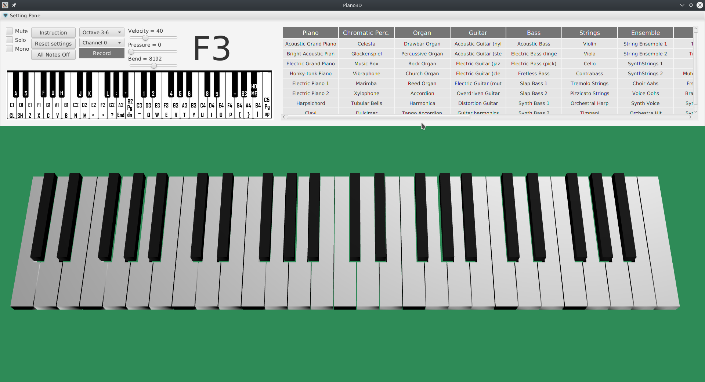

## Virtual 3D Piano
This program is a virtual piano. The application also contains the functionality of a MIDI synthesizer.
## Info
Here is a [video](https://youtu.be/DNp6TcFBGdk) of the program in action<br/>

# Download
Here is a [.jar](https://drive.google.com/file/d/1ejdHIaajP7dllBXU7ieOBCYL51Dw18A8/view?usp=sharing) file with run files .sh and .cmd
# Run
To run the .jar do not forget to write VM OPTIONS<br/>
``` bash
--module-path ${PATH_TO_FX} --add-modules javafx.controls,javafx.graphics
``` 

Sometimes it requires to write the path to JavaFx by itself, and not take it from PATH_TO_JAVAFX <br/>

As content option .sh<br/>
``` bash 
export PATH_TO_FX="/opt/javafx-sdk-11.0.2/lib
java —module-path %PATH_TO_FX% —add-modules javafx.controls,javafx.graphics -Dfile.encoding=UTF-8 
-jar /home/vara/idea_projects/virtualpiano/course_work/out/artifacts/course_work_jar/course_work.jar 
```  
Another option if .jar is near to .sh
``` bash 
java --module-path /opt/javafx-sdk-11.0.2/lib --add-modules javafx.controls,javafx.graphics -jar course_work.jar
```

To run .jar program
.jar must be near to .sh, or write the path<br/> 
``` bash 
/bin/bash startPiano.sh
 ```
# Tech

* [JavaFx](https://www.oracle.com/java/technologies/javase/javafx-overview.html)
* [JavaSound](https://www.oracle.com/java/technologies/java-sound-api.html)
* [FXyz3D lib](https://github.com/FXyz/FXyz)
# Development
If you want to change keyboard keyCodes you can change it in name_of_keys.txt<br/>
If you want to add keys in virtual piano you can add it in source.txt<br/>

# Structure

- Main project 
    - piano3D/
- Custom shapes
    - customShapes/
- Sources    
    - source.txt offset valueOctave x y z
    - name_of_keys.txt keyName type nameOfCode

# Documentation
Generate JavaDoc and watch documentation here
 - out/index.html
# OS
KUbuntu 18.04

### Useful links
https://stackoverflow.com/questions/34571962/convert-javafx-node-group-or-shape3d-to-mesh
<br/>
https://stackoverflow.com/questions/26831871/coloring-individual-triangles-in-a-triangle-mesh-on-javafx/26834319#26834319
<br/>
https://stackoverflow.com/questions/47321846/how-to-add-a-source-code-library-to-intellij-for-example-from-github
<br/>
https://stackoverflow.com/questions/61231437/how-to-create-such-shape-using-javafx-trianglemesh/61239299#61239299
<br/>